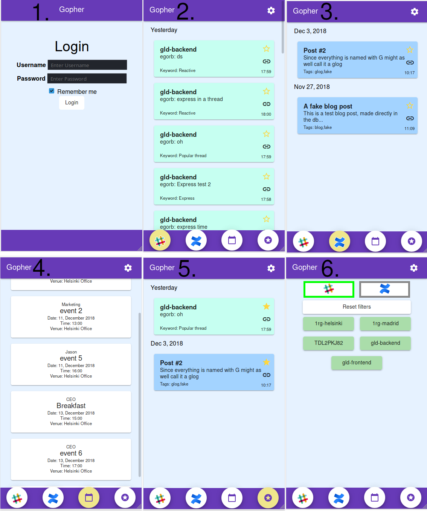

# Gopher

This project is meant to be a help companies for improve their communication and make it faster and easier. It gather information from two different sources, which are slack and confluence and show it in one place. Application shows messages from slack which are important and shows newest blog posts and most important changes in confluence. Login system and calendar are not implemented yet.

## Features
* Log in system
* Feed for new slack messages
* Feed for new confluence posts
* Week calendar for showing events
* Filter content
* Starred page

## Getting started
To get started with gopher you need to have npm package manager, slack, confluence(we use fakedata), gopher-bot, gopher-backend and mongoDB.

## Prerequisites
* [npm](https://www.npmjs.com/get-npm)
* [slack](https://slack.com/)
* [confluence](https://www.atlassian.com/software/confluence)
* [gopher-bot](https://github.com/Gopher2k18/gopher-bot)
* [gopher-backend](https://github.com/Gopher2k18/gopher-backend)
* [MongoDB](https://www.mongodb.com/)

## Build and run

1. Clone this project \
`git clone https://github.com/Gopher2k18/gopher`

2. Install dependencies \
`npm install`

3. Run application \
 `ng serve --open`

## Built with
 * Angular
 * Git for version control
 * Project managing tool [git project](https://github.com/Gopher2k18/gopher/projects/1)
 
 ## Screenshots
 
 1. Log in page(not working)
 2. Slack feed
 3. Confluence feed(dummy data)
 4. Event calendar(not working)
 5. Starred page
 6. Filtering page
